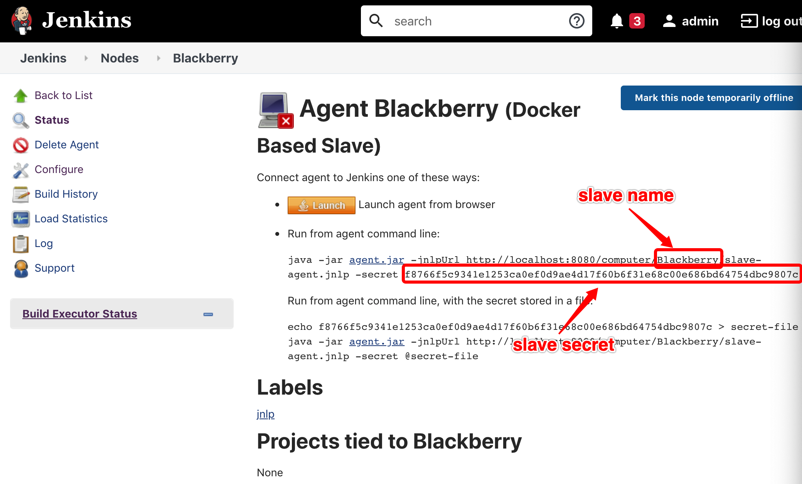
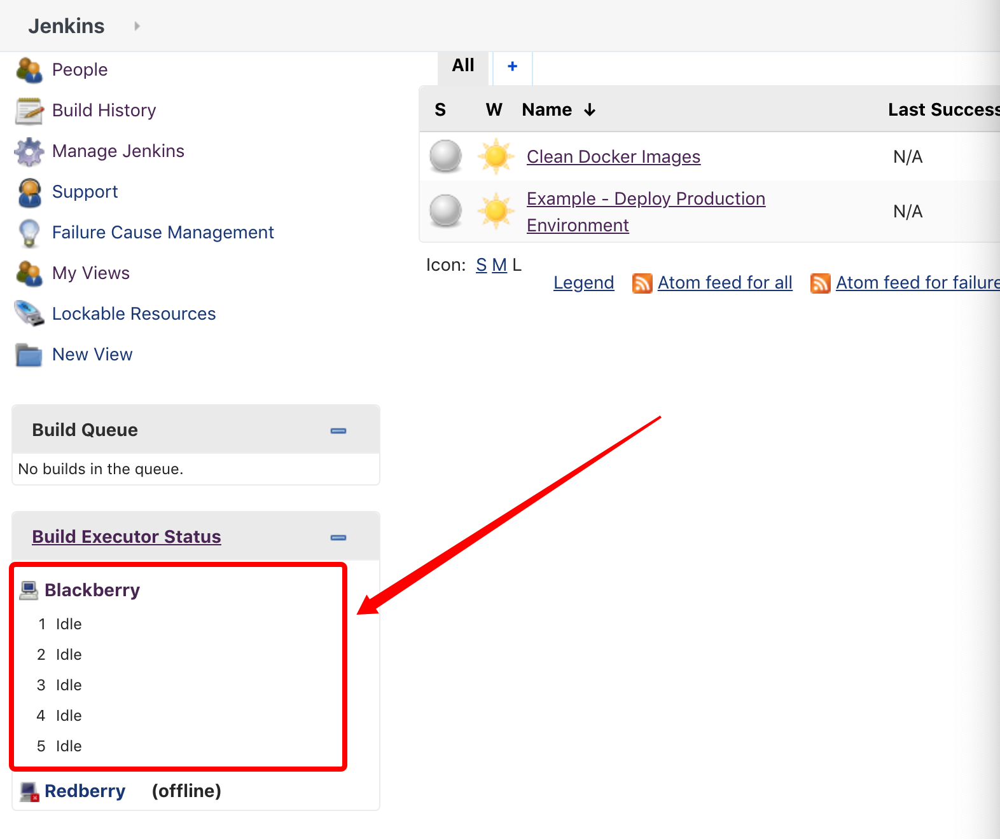

中文 | [English](./README.md)

# jenkins-cluster

使用Docker部署Jenkins集群

## 动机

曾经有人问我怎么给Jenkins做灾备，但Jenkins只是个工具，任何业务系统都不应该依赖于一个工具的数据完整性。因此我做了这个开源项目，希望能帮助更多的人学习怎么通过脚本来生成一个Jenkins集群，以及如何通过代码来生成Jenkins Job。而不是在Jenkins网页控制台上点击按钮来配置，并在硬盘上持久化Jenkins生成数据文件，这样做不仅会因为硬盘损坏等原因导致配置信息全部丢失，也非常不便于维护。
在我以往的项目经历中，团队一般会部署一个Jenkins Father，其他Jenkins集群都分别有一个类似于本项目的Git repo，然后在Jenkins Father上分别配置一个任务，用该任务来发布其他Jenkins的新版本。

## 介绍

### 使用

1. 在项目目录下执行`make build`来打包docker镜像
2. 修改Makefile中run-master里面`docker run`命令的环境变量，执行`make run-master`来运行Jenkins Master
3. 访问localhost:8080，并使用admin用户登陆（默认密码admin），登陆后查看任一slave节点，获取slave的name和secret，将其填入Makefile中，并执行`make run-slave`，或执行`make SLAVE_NAME=<slave name> SLAVE_SECRET=<slave secret> run-slave`

（注意我们将宿主机上的/var/run/docker.sock文件挂在到slave容器中，使得slave容器里面的docker client能够访问到宿主机上的docker daemon）
4. 登陆Jenkins，查看slave是否处于online状态

5. 执行`make stop`来关闭Jenkins集群

### 目录结构

主目录下主要有2个子目录
- master : Jenkins master相关代码
- slave : Jenkins slave相关代码
和3个文件
- plugins.txt : 需要安装的Jenkins插件，每行包含插件名和插件版本，在打包docker镜像时安装这些插件要安装、卸载、更新插件时，应该修改这个文件，并使用git来做整个Jenkins集群的版本控制
- Dockerfile
- .Dockerignore

master目录下conf子目录有2个文件
- credential.properties : 包含credentials的信息（credential可以认为是存储在Jenkins上面的钥匙串），这个文件应该使用docker secrets / kubernetes secret / vault来存储
- slaves.properties : 定义Jenkins slave

master目录下jobs包含2个文件，每个文件定义了一个Jenkins job，如果你要添加Jenkins Job，请使用Job dsl定义，并将代码置于此目录 （任务定义的语法文档可看[这里](https://jenkinsci.github.io/job-dsl-plugin/)）
- clean_docker_images.groovy : 定期清理docker image，防止挤爆磁盘
- example.groovy : 一个Jenkins Job定义示例

master目录下init.groovy.d包含9个groovy脚本文件，里面包含了Jenkins本身的配置，也包括一些Jenkins plugin的配置，Jenkins启动时会自动去运行这些脚本。如果你要增加或修改Jenkins其他配置，请将配置代码放在这个目录下。如果你需要在项目中使用其他插件，请参考插件文档，学习如何通过groovy脚本来使用该插件
- general.groovy : 设置Jenkins build目录
- clean_protocols.groovy : 关闭不安全的Master - Slave通信协议（老版本协议）
- csrf.groovy: 防止CSRF攻击
- create_user.groovy : 创建Jenkins用户，这里创建了admin用户，但在生成中不建议这种方式，有条件的话应该使用saml / ldap或oauth
- authorization.groovy : 给用户授权，使用的是矩阵授权策略，admin用户授予管理权限，登录用户授予read权限（任务读取、执行等权限应在每个job中定义，如果觉得每个job都要授权多个用户很麻烦，可以对用户进行分组，对组授权），未登录用户只有执行slave agent的权限
- credential.groovy : 读取conf文件夹下的credential.properties，通过它来创建credentials
- seed.groovy : 执行jobs目录下的groovy脚本来创建Jenkins任务
- job_dsl_security.groovy : jobs dsl(Domain Specific Language)安全相关配置
- slaves.groovy : 读取conf文件夹下的slaves.properties，通过它来创建Jenkins slave

slave目录包含3个文件
- docker-entrypoint.sh : 包含了将slave连接到master的命令
- Dockerfile : 通常情况下你需要修改这里面的代码，在slave上安装你需要的工具
- .Dockerignore
